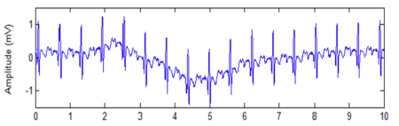
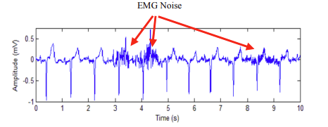

<h3>Introduction</h3>

Electrocardiogram (ECG) is a biosignal representing the electrical activities of the heart muscle. The common obstacle in analyzing and interpreting the ECG signal is the presence of unwanted artefacts and noises introduced during signal acquisition and transmission that contaminate or degrade the quality of ECG signal. A clean and noise-free ECG signal plays an imperative and vital part in the clinical analysis and diagnosis of cardiac abnormalities and diseases. Thus, the removal of these unwanted noises is an indispensable task to ensure a reliable ECG analysis performance. In this experiment, various types of noise contaminating the ECG signal are briefly discussed and several types of filter are modelled to denoise the raw ECG signal. 

<h4>Sources of Noise or Artifacts in ECG Signals</h4>

In medicine and biology, the term artifact refers to any component of a signal that is extraneous to the variable represented by the signal. An ECG signal is contaminated and corrupted by various types of noise due to its low slope and amplitude properties where its waveform can be altered or changed. Thus, ECG de-noising is a crucial task as an effective and reliable de-noising enables accurate clinical analysis and avoids misleading diagnosing cardiac abnormalities and diseases. Due to this reason, it is important to understand the properties and sources of common ECG artifacts and noises while designing a suitable de-noising method. 

Thus, random noise generated within the measuring instrument, electrical interference (including 60-Hz pickup), cross-talk, and all other unwanted variations in the signal are considered artifacts. These sources fall under non-physiological artifacts, as they originate from external equipment, environment, or system electronics rather than the human body. On the other hand, physiological artifacts arise from the subject’s own biological activities, such as respiration, muscle contractions, eye movements, or body motion. A major source of artifacts in the measuring of a living system is the movement of the subject, which in turn results in movement of the measuring device. Since many transducers are sensitive to movement, the movement of the subject often produces variations in the output signal. Sometimes these variations are indistinguishable from the measured variable; at other times they may be sufficient to obscure the desired information completely. 

<h4>A. Baseline Wander</h4>
It is a low-frequency noise of just about 0.6 to 0.7 Hz. This noise is known as baseline wander because it moves up and down rather than straight, as shown in figure 1. Mainly, it is used by the patient's movements and due to respiration. Sometimes it is also caused by electrodes.     
  

  

 

  <b>Figure 1: ECG signal with baseline wandering.</b>

 

<h4>B. Power-Line Interference</h4>

Electromagnetic fields induced by a powerline are a joint exporter of noise in the ECG, beside each other bioelectrical signals registered from the human surface. This type of noise is described through sinusoidal interference of 50 or 60 Hz and may be accompanied by a number of harmonics. Noise of the narrowband makes ECG analysis and translation more difficult because low capacity waveforms become mistaken and wrong waveforms can be generated. Because low frequency ECG waves such as the P wave and T wave are completely superimposed by powerline interference, it is necessary to remove it from ECG signals.<b>Figure 2</b> depicts an ECG signal influenced by a powerline interfacial.
  

  

 

  <b>Figure 2:  ECG signal with powerline interference.</b>

 

<h4>C. Electrode Motion Artifact</h4>

Electrode motion artifacts are commonly caused by skin stretching, which changes the impedance at the skin–electrode interface. These artifacts exhibit signal characteristics similar to baseline wander but are more challenging to eliminate because their spectral content significantly overlaps with the PQRST complex. They are most prominent in the frequency range of 1–10 Hz and may appear as large-amplitude waveforms that can be mistakenly identified as QRS complexes. 

  

 

  <b>Figure 3: ECG signal with electrode motion noise.</b>

 
<h4>D. Electromyography (EMG) Noise</h4>

Muscle noise is a significant problem in ECG recordings, particularly during physical activity or exercise. Low-amplitude ECG waveforms can become highly disorganized due to EMG interference. Unlike baseline wander and powerline noise, EMG noise cannot be effectively removed using narrowband filtering, as its spectral content overlaps substantially with that of the PQRST complex. Because ECG signals are repetitive in nature, techniques similar to those used in evoked potential processing may be applied to reduce muscle noise; however, such methods are limited to consistent QRS morphologies.

  

 

  <b>Figure 4: ECG signal with electromyography noise.</b>

 

<h4>Frequency Spectrum Analysis of ECG</h4>

An ECG signal consists of three primary components: the P-wave, the QRS complex (Q, R, and S waves), and the T-wave. The P-wave represents atrial depolarization and has a relatively small amplitude (≈0.25 mV) with a frequency range of 5–30 Hz. The QRS complex corresponds to rapid ventricular depolarization and is the most dominant component of the ECG signal, with R-wave amplitudes reaching up to 1.6 mV and frequency content between 8–50 Hz. The T-wave represents ventricular repolarization and has a broader amplitude range (0.1–0.5 mV), with frequency components mainly below 10 Hz. 

  

 

  <b>Figure 5: ECG signal components show the onset and offset of each wave.</b>

 

<h4>Table 1: Typical Amplitudes and Frequency Ranges of ECG Waves</h4>

| ECG Wave | Typical Amplitude	 | Frequency Range |
| --- | --- | ---| 
| P Wave	 | ≈ 0.25 mV | 5 – 30 Hz |
| QRS Complex | Largest R-wave ≈ 1.6 mV | 8 – 50 Hz |
| T Wave | 0.1 – 0.5 mV | 0 – 10 Hz |

 Table 1 indicates that the <b>P-wave</b>, which corresponds to atrial depolarization, has a relatively small amplitude of approximately<b>  0.25 mV </b> and occupies a moderate frequency band ranging from <b>5 to 30 Hz</b> . Because the frequency content of the P-wave overlaps with motion artifacts and muscle (EMG) noise, careful filtering is required to preserve this low-energy component without distortion.  

The <b>QRS complex</b>, representing rapid ventricular depolarization, is the most prominent component of the ECG signal. The R-wave amplitude can reach up <b> to 1.6 mV </b> , and its frequency content typically lies between <b> 8 and 50 Hz</b> . This frequency range reflects the sharp, high-slope nature of ventricular activation. Preservation of the QRS complex with high fidelity is essential, as it carries critical clinical information for arrhythmia detection, ventricular conduction analysis, and accurate heart-rate determination.  

The <b>T-wave</b>, related to ventricular repolarization, has a broad amplitude range <b>(0.1–0.5 mV)</b> and lies mainly within <b>0–10 Hz</b> . Its low-frequency nature makes it highly susceptible to baseline wander, respiration artifacts, and electrode movement.

  

<h4>Filters Used in ECG Processing</h4>

There are so many techniques to denoise the ECG signal. Every method has its potential, and it is pivotal because these methods might help the doctors to analyze the patient's situation regarding cardiac diseases in a more accurate manner. In this section some prominent methods used for removal of noise are discussed.
 

<h4>1. High-Pass Filter (HPF)</h4>

A high-pass filter removes low-frequency artifacts such as baseline wander caused by respiration and electrode movement. Using a typical cutoff of 0.5 Hz, it stabilizes the ECG baseline while preserving clinically important components like the P-wave, QRS complex, and T-wave.

<h4>2. Low-Pass Filter (LPF)</h4>

A low-pass filter attenuates high-frequency noise from muscle activity (EMG), motion spikes, and electronic interference. With common cutoffs below 40–150 Hz, it ensures the QRS complex and other ECG features remain smooth and clearly identifiable.

<h4>3. Notch Filter (Band-Stop)</h4>

A notch filter targets and removes narrow-band electrical power-line interference at 50/60 Hz without affecting nearby ECG frequencies. This filter is essential in clinical environments to eliminate equipment-induced noise.

<h4>4. Band-Pass Filter (BPF)</h4>

A band-pass filter retains only the primary ECG frequency range (0.5–40 Hz), removing both low-frequency drift and high-frequency noise simultaneously. It enhances the signal-to-noise ratio and is especially effective for accurate QRS detection.
 

  

 

  <b>Figure 6: Four basic filter types (f=frequency , a = amplitude).</b>

 

<h4>Filter Design in ECG Processing</h4>

Filtering plays a central role in ECG preprocessing, where the goal is to enhance diagnostically relevant components (P-wave, QRS complex, T-wave) while suppressing physiological and non-physiological noise. Among digital filter architectures, Finite Impulse Response (FIR) and Infinite Impulse Response (IIR) filters are the two most widely adopted due to their complementary advantages in biomedical signal processing. The filter is designed with a low pass, high pass and notch filter using specific and suitable cut-off frequency to suppress and eliminate the artefacts and noises that common encountered with. 

<h4>Butterworth Filters (IIR)</h4>

A Butterworth filter is a type of signal processing filter characterized by a frequency response that is maximally flat over the passband region, meaning it does not introduce ripples within the passband and maintains a smooth amplitude response. This property makes it suitable for applications requiring minimal amplitude distortion within the desired frequency range. 
 

The frequency response of an 𝑛-th order Butterworth low-pass filter is expressed as:  

  

 
Where:

<ul>
  <li><b>G(ω)</b> represents the magnitude response (gain) of the filter.</li>
  <li><b>ω</b> denotes the angular frequency expressed in radians per second.</li>
  <li><b>ωc</b> is the cutoff frequency of the filter, defined as the frequency at which the gain drops to −3 dB from its maximum value.</li>
  <li><b>n</b> is the filter order, also referred to as the number of poles in the filter transfer function.</li>
  <li><b>G0</b> represents the DC gain, which is the gain at zero frequency.</li>
</ul>

N = 1 &nbsp;……………………………&nbsp; 1st-order Butterworth filter 
N = 2 &nbsp;………………………………………&nbsp; 2nd-order Butterworth filter 
N = 3 &nbsp;…………………………………………………………&nbsp; 3rd-order Butterworth filter 
Order means to improve the accuracy of the filter, if we require more accuracy we require more order (value of N is high).
 

 Above Figure 7 illustrates the magnitude response of Butterworth low-pass filters of orders 1 through 5, all having the same cutoff frequency at ω = 1 rad/s, where the gain falls to −3 dB. As the filter order increases, the passband remains maximally flat while the transition region between the passband and stopband becomes progressively steeper. Additionally, the stopband attenuation improves from −20 dB/decade for a first-order filter to −100 dB/decade for a fifth-order filter. This behavior demonstrates the characteristic roll-off rate of 20<i>n</i> dB/decade that defines Butterworth filters. 

  

 

  <b>Figure 7:gain of Butterworth low-pass filters of orders 1 through 5</b>

 

Like all filters, the typical prototype is the low-pass filter, which can be modified into a high-pass filter.  

<h4>ECG-Specific Butterworth Filter Specifications</h4>

<ul>
  <li>For ECG signal filtering, Butterworth filters are typically implemented with the following characteristics:
    <ul>
      <li><b>Low-pass Butterworth filter:</b> Used for removal of EMG interference and high-frequency noise.</li>
      <li><b>High-pass Butterworth filter:</b> Applied for baseline wander removal.</li>
      <li><b>Band-pass Butterworth filter:</b> Used for isolation of the primary ECG frequency band.</li>
      <li><b>Notch Butterworth filter:</b> Used for suppression of 50/60 Hz power-line interference.</li>
    </ul>
  </li>
</ul>

<h4>Window-Based FIR Filters</h4>
The Finite Impulse Response (FIR) filter is a digital filter whose impulse response has a strictly finite duration: when an impulse is applied at the input, the output is non‑zero only for a limited number of samples and then becomes exactly zero. Because FIR filters are realized without feedback (only present and past input samples are used), they are inherently stable and structurally simple to implement. Their behavior is fully determined by a finite set of coefficients, which can be chosen to yield an exactly linear‑phase response, ensuring that all frequency components of the input signal experience the same time delay and that waveform shapes are preserved.
Windowing technique  is one of the quickest and the simplest ways of designing FIR filters. Filter designed using windowing technique approaches ideal filters with some approximation errors. Designing the ideal low pass filter in the frequency domain with a cut off frequency Fc and transforming this to time domain results in sinc function that extends to infinity in both sides, which results in a substantial number of taps which is not practical thus it must be truncated. To do so the impulse response has been multiplied with a window function which truncates the infinite impulse response to a finite impulse which is needed by a FIR filter This is done using windows. Different windows used in FIR filter design are: 
 

<h4>Common Window Functions Used in FIR Filter Design</h4>

<ul>
  <li>Rectangular Window</li>
  <li>Hamming Window</li>
  <li>Hanning Window</li>
  <li>Blackman Window</li>
  <li>Kaiser Window</li>
  <li>Bartlett Window</li>
</ul>

<h4>Window Function Characteristics</h4>

<ul>
  <li><b>Main-lobe width:</b> Controls the sharpness of the transition band between the passband and stopband.</li>
  <li><b>Side-lobe level:</b> Determines how effectively the filter suppresses noise and reduces spectral leakage.</li>
  <li><b>Filter order (length):</b> Defines the trade-off between filter accuracy and computational complexity.</li>
</ul>

